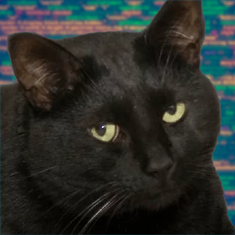
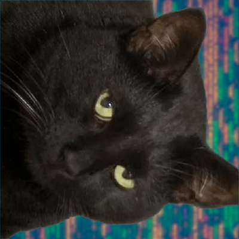

# image rotation 

With Unix environments 


# c_bmp_image_rotation
## Laboratory work on programming languages (C)
### Build & run
- Edit C with Vim in the console. I employ makefiles and have a number of compilers to test my code against, including gcc, clang (LLVM) and icc
- To build you need to type `make` in the root directory.
- After that to run you need to type `./build/rotator`

### Example of execution
#### Input and output
```
./build/rotator examples/cat.bmp examples/cat_out.bmp 
```
```
Input File: 'CuteKat/cat.bmp' 
Output File: 'CuteKat/cat_out.bmp'
Файл для чтения/записи открыт
Image form file is loaded
Файл для чтения/записи открыт
Image is saved in file
Memory freed
```
#### Input and output files:
 
